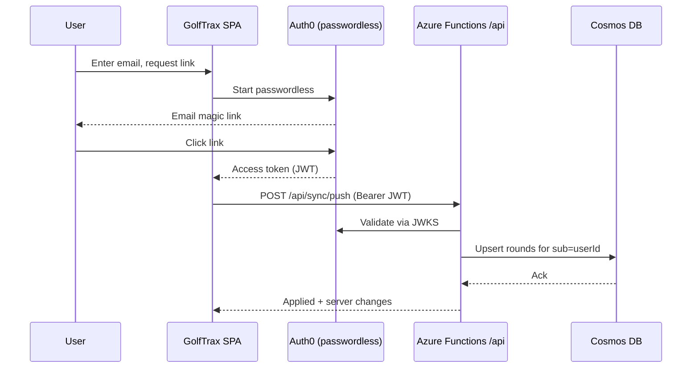

# Phase 2 Design: Backend, Accounts & Sync

Status: **proposed** · Author: design draft for review · Supersedes the "Phase 2"
bullets in `golf-app-mvp-requirements-final.md`.

## 1. Goal & guiding principles

Let a user sign in and have their rounds sync across devices — **without
regressing the offline-first, no-login MVP.**

Principles that constrain every decision below:

1. **Offline-first stays intact.** The app must work fully offline, from a cold
   first launch, with no account. IndexedDB (Dexie) remains the source of truth
   the UI reads from. Sync is a background reconciliation layer, never a
   prerequisite for using the app.
2. **Accounts are optional.** Signing in *enables* cloud sync; it is never
   required to log or view rounds. Local-only remains a first-class mode.
3. **This app is standalone.** GolfTrax reuses infrastructure patterns the
   author already operates (Azure, Auth0) but shares **no** backend, database,
   or user records with any other product. Its Auth0 application, its Cosmos
   account, and its user identities are dedicated to GolfTrax.
4. **The backend is auth-issuer-agnostic.** Functions validate a JWT via the
   issuer's JWKS and read a stable user id from a claim. The rest of the design
   does not depend on *which* issuer that is, so the auth choice stays swappable.

### Non-goals for Phase 2 (deferred)

- Social/sharing, leaderboards, peer comparison (Phase 4).
- Official USGA handicap, advanced analytics (Phase 3).
- Manual course entry and geolocation "nearby courses" — these are Phase 2 in
  the original spec but are **independent of sync**; tracked as a separate slice
  (2d) after this work.
- Real-time / multi-writer collaboration. Rounds are single-user; we do not need
  CRDTs or live presence.

## 2. Decisions (locked)

| Area | Decision | Notes |
| --- | --- | --- |
| Backend | Extend GolfTrax's existing Azure Functions `/api` | Already built & deployed via the SWA workflow; no new pipeline or infra. |
| Storage | **Cosmos DB (serverless)** | Rounds are self-contained JSON documents — a natural document-store fit; serverless = pay-per-request for a personal app. |
| Auth | **Auth0**, dedicated GolfTrax tenant/application, **passwordless email magic link** | Author already operates Auth0; handles token issuance, single-use/expiry, refresh, and email delivery. |
| Account model | **Optional** — login enables sync | Preserves the frictionless MVP; local-only keeps working. |
| Sync | Per-record **last-write-wins**, delta (push/pull) with tombstones | Single-user records → conflicts are rare; LWW by `updatedAt` is sufficient. |

## 3. Why this is tractable: the MVP is already sync-ready

The current local schema (`src/db/types.ts`) needs surprisingly little to
support sync:

- **Rounds already carry a UUID `id`.** No server-assigned IDs, so no
  create-time reconciliation — a record has the same identity on every device.
- **Rounds already carry `updatedAt` (ISO).** That is exactly the field LWW
  needs to decide the winner between two versions.
- **Rounds already snapshot their hole/tee/course data.** A synced round is
  self-contained; it doesn't require the receiving device to also have the
  course cached. This keeps sync to a single logical entity.

### Gaps to close

1. **Deletes are hard deletes** (`roundsRepo.deleteRound` → `db.rounds.delete`).
   A hard delete can't propagate to other devices. → introduce **tombstones**.
2. **No per-record sync state.** We can't tell which local rounds have unsynced
   edits. → add a local `dirty` flag + a global sync cursor.
3. **Courses are cached only locally.** For sync we only strictly need to sync
   *rounds* (they're self-contained); course cache can stay device-local. See
   §6.3.

## 4. Authentication (Auth0 passwordless)

- A **dedicated Auth0 application** for GolfTrax with the **Passwordless: Email**
  connection (magic link). No passwords, no social — one field: email.
- The SPA uses Auth0's SDK to run the passwordless flow and obtain an
  **access token** (JWT) for the GolfTrax API audience.
- **Functions validate the JWT** on every `/api/sync/*` call: verify signature
  against Auth0's JWKS, check `iss`/`aud`/`exp`, and derive the user id from the
  `sub` claim. **The user id always comes from the verified token, never from
  the request body.**
- **Offline tolerance:** an expired token with no network must not break the
  app. The client treats "no valid token" as simply "sync paused" — the local
  UI keeps working; sync resumes when a token can be refreshed online.

## 5. Data model

### 5.1 Cosmos containers

- **Container `rounds`** — one document per round.
  - Partition key: `/userId` (all of a user's rounds co-located; queries are
    always scoped to one user).
  - Document shape: the existing `Round` fields **plus** `userId`, `deletedAt`
    (nullable ISO for tombstones), and a server `_ts` (Cosmos-native) used as
    the pull cursor.
- **Container `profile`** — one document per user (`id === userId`), storing the
  profile (display name, sync metadata). Partition key `/userId`.
- Courses are **not** synced in this phase (see §6.3); no server container.

RU/serverless note: access is always a point-read or a single-partition query by
`userId`, which keeps RU cost minimal and predictable.

### 5.2 Client (Dexie) changes

Add sync bookkeeping without disturbing the existing tables:

- On `rounds`: add local-only fields `dirty: boolean` (has unsynced local edits)
  and `deletedAt?: string` (tombstone). These are **not** sent to the UI as
  round data; they drive the sync engine.
- New singleton `syncState` row: `{ lastPulledTs, userId, status }`.
- Every mutation in `roundsRepo` that writes a round sets `dirty = true` and
  refreshes `updatedAt` (most already refresh `updatedAt`).
- `deleteRound` becomes a **soft delete**: set `deletedAt` + `dirty`, hide from
  queries, and only hard-remove locally *after* the tombstone has synced.
- A Dexie schema **version bump** with a migration that backfills `dirty=false`
  on existing rows (they're considered already-local, not yet synced).

## 6. Sync engine

### 6.1 Strategy

Per-record **last-write-wins by `updatedAt`**, reconciled with a two-phase
**push then pull** delta. Because a round is edited by one person on one device
at a time, genuine conflicts are rare; when two versions collide, the later
`updatedAt` wins and the older is discarded. This is intentionally simple — no
field-level merge, no CRDT.

### 6.2 Endpoints

- `POST /api/sync/push`
  - Body: `{ rounds: Round[] }` — the caller's `dirty` rounds (incl. tombstones).
  - Server upserts each into Cosmos **iff** the incoming `updatedAt` is newer
    than the stored one (LWW); stamps `userId` from the JWT.
  - Returns per-record results so the client can clear `dirty`.
- `GET /api/sync/pull?since=<ts>`
  - Returns all of the user's rounds with server `_ts > since` (including
    tombstones), plus the new `maxTs` cursor.
- A single round-trip = push local changes, then pull remote changes since the
  stored cursor and apply LWW locally.

### 6.3 Courses

Courses stay **device-local** for Phase 2. A synced round already contains the
hole/tee data the UI needs, so a second device can display and edit a round
without the course cache. The only degraded case is the "recently played"
carousel on a fresh device (empty until that device plays/looks up courses) —
acceptable, and avoids syncing a second entity now. (Revisit if we later want
cross-device recents.)

### 6.4 Anonymous → account merge

First login on a device with existing local rounds:

1. All local rounds are marked `dirty` and **pushed**; the server stamps them
   with the new `userId`.
2. Because ids are UUIDs, merging a device's history into a (possibly non-empty)
   account is collision-free — same-id rounds LWW-reconcile, new ids are added.
3. Then a normal pull brings down anything the account already had on other
   devices.

No "claim anonymous data?" prompt is needed in the simple case — local rounds
are the user's own; they simply become synced. (A future multi-account edge —
signing into account B on a device that has account A's synced data — is handled
by clearing local synced rounds on logout; noted in §9.)

### 6.5 Triggers

Sync runs: on login, on regaining connectivity (reuse the `useOnlineStatus`
hook from the MVP hardening pass), after a round is finalized, and on a light
interval while the app is foregrounded. All sync is best-effort and idempotent.

## 7. Client UX

- **Settings** (the page added in the hardening pass) gains a **Sign in** /
  account section and a **sync status** line ("All changes synced" / "Syncing…"
  / "Offline — will sync later" / "Sign in to sync across devices").
- Existing **backup export/import stays** — it's the escape hatch and the
  local-only user's story; nothing here removes it.
- No blocking spinners tied to sync; the app never waits on the network to
  render local data.

## 8. Delivery slices

1. **2a — Auth + backend skeleton.** Auth0 passwordless in the SPA; JWT
   validation in Functions; Cosmos account + `rounds`/`profile` containers;
   profile stored server-side. *No round sync yet.* De-risks the auth path end
   to end.
2. **2b — Sync engine.** Client `dirty`/tombstone/cursor bookkeeping + Dexie
   migration; `push`/`pull` endpoints; LWW; anonymous→account merge; sync-status
   UI. This is the core of the phase.
3. **2c — Hardening.** Conflict/edge cases, token refresh while offline,
   retry/backoff, partial-sync recovery, logout data handling.
4. **2d — (separate) Manual course entry + geolocation.** Independent of sync;
   sequenced after.

## 9. Risks & open questions

- **Sync correctness is the main risk** — tombstone lifecycle, cursor drift,
  and the merge path are where bugs hide. Mitigation: put reconciliation logic
  in a **pure, unit-tested module** (mirroring the existing `src/domain/*`
  pattern) so LWW/merge/tombstone rules are tested without IndexedDB or network.
- **Logout on a shared device** — must clear locally-cached *synced* rounds so
  the next user doesn't see them, while ideally preserving genuinely
  local-only (never-signed-in) data. Needs an explicit rule in 2c.
- **Token refresh offline** — define the exact "paused" state and resume
  behavior so the app is never blocked by an expired token.
- **Cost/ops** — serverless Cosmos + an Auth0 app add a (small) bill and an
  operational surface a local-only app didn't have. Worth a quick cost check at
  expected volume before 2a.
- **Cosmos vs. relational** — locked to Cosmos; revisit only if a future feature
  needs heavy relational querying across users (none in this phase).

## 10. What does NOT change

- The local-only experience for users who never sign in.
- IndexedDB as the UI's source of truth.
- The self-contained round snapshot model.
- Backup export/import.
- The existing round-logging, stats, and history flows.
