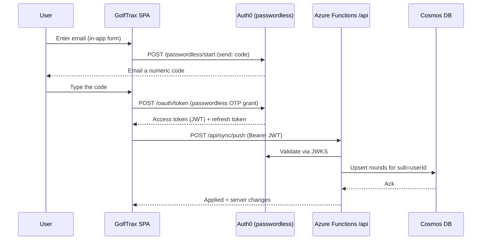

# Phase 2 Design: Backend, Accounts & Sync

Status: **reviewed & hardened** · Author: design draft + hardening review ·
Supersedes the "Phase 2" bullets in `golf-app-mvp-requirements-final.md`.
Hardening decisions from the requirements review are consolidated in §11.

## 1. Goal & guiding principles

Let a user sign in and have their rounds sync across devices — **without
regressing the offline-first, no-login MVP.**

Principles that constrain every decision below:

1. **Offline-first stays intact.** The app must work fully offline, from a cold
   first launch, with no account. IndexedDB (Dexie) remains the source of truth
   the UI reads from. Sync is a background reconciliation layer, never a
   prerequisite for using the app.
2. **Accounts are optional.** Signing in *enables* cloud sync; it is never
   required to log or view rounds. Local-only remains a first-class mode.
3. **This app is standalone.** GolfTrax reuses infrastructure patterns the
   author already operates (Azure, Auth0) but shares **no** backend, database,
   or user records with any other product. Its Auth0 application, its Cosmos
   account, and its user identities are dedicated to GolfTrax.
4. **The backend is auth-issuer-agnostic.** Functions validate a JWT via the
   issuer's JWKS and read a stable user id from a claim. The rest of the design
   does not depend on *which* issuer that is, so the auth choice stays swappable.

### Non-goals for Phase 2 (deferred)

- Social/sharing, leaderboards, peer comparison (Phase 4).
- Official USGA handicap, advanced analytics (Phase 3).
- Manual course entry and geolocation "nearby courses" — these are Phase 2 in
  the original spec but are **independent of sync**; tracked as a separate slice
  (2d) after this work.
- Real-time / multi-writer collaboration. Rounds are single-user; we do not need
  CRDTs or live presence.

## 2. Decisions (locked)

| Area | Decision | Notes |
| --- | --- | --- |
| Backend | Extend GolfTrax's existing Azure Functions `/api` | Already built & deployed via the SWA workflow; no new pipeline or infra. |
| Storage | **Cosmos DB (serverless)** | Rounds are self-contained JSON documents — a natural document-store fit; serverless = pay-per-request for a personal app. |
| Auth | **Auth0**, dedicated GolfTrax tenant/application, **passwordless email magic link** | Author already operates Auth0; handles token issuance, single-use/expiry, refresh, and email delivery. |
| Account model | **Optional** — login enables sync | Preserves the frictionless MVP; local-only keeps working. |
| Sync | Per-record **last-write-wins** by a **server-stamped version**, delta (push/pull) with tombstones | Single-user records → conflicts are rare. The winner is decided by a server-authoritative version, **not** the client clock — see §11.1. |
| Conflict authority | **Server-authoritative** — server stamps `version` + `serverUpdatedAt` on every write; that decides the winner | Client wall-clock (`updatedAt`) is display/intent only; immune to device clock skew and equal-timestamp ties. |
| Delete semantics | **Delete wins** over a concurrent edit | A tombstone is never resurrected by a later edit; see §11.2. |

## 3. Why this is tractable: the MVP is already sync-ready

The current local schema (`src/db/types.ts`) needs surprisingly little to
support sync:

- **Rounds already carry a UUID `id`.** No server-assigned IDs, so no
  create-time reconciliation — a record has the same identity on every device.
- **Rounds already carry `updatedAt` (ISO).** That is exactly the field LWW
  needs to decide the winner between two versions.
- **Rounds already snapshot their hole/tee/course data.** A synced round is
  self-contained; it doesn't require the receiving device to also have the
  course cached. This keeps sync to a single logical entity.

### Gaps to close

1. **Deletes are hard deletes** (`roundsRepo.deleteRound` → `db.rounds.delete`).
   A hard delete can't propagate to other devices. → introduce **tombstones**.
2. **No per-record sync state.** We can't tell which local rounds have unsynced
   edits. → add a local `dirty` flag + a global sync cursor.
3. **Courses are cached only locally.** For sync we only strictly need to sync
   *rounds* (they're self-contained); course cache can stay device-local. See
   §6.3.

## 4. Authentication (Auth0 passwordless — embedded email code)

- A **dedicated Auth0 application** for GolfTrax with the **Passwordless: Email**
  connection. No passwords, no social — one field: email.
- **Embedded, not hosted.** The SPA renders its **own** two-step sign-in form
  (`src/auth/SignInDialog.tsx`) and calls Auth0's passwordless endpoints
  directly (`src/auth/passwordlessClient.ts`): `POST /passwordless/start` emails
  a **numeric code**, then `POST /oauth/token` (the passwordless-OTP grant)
  exchanges the code for an **access token** (JWT) for the GolfTrax API
  audience, plus a refresh token.

  > **Why embedded, and why a code not a link.** The New Universal Login
  > experience doesn't support the passwordless flow, and the Classic hosted
  > page proved fragile to even load — the redirect *was* the failure. A magic
  > link also opens in whatever browser the mail app picks (often not the
  > installed PWA), so the session lands in the wrong context. An in-app code
  > has no redirect and no hosted page: nothing to fail to load, and it fills
  > from the OS one-time-code suggestion on mobile. The backend is unchanged and
  > issuer-agnostic (§1.4), so this is purely a client swap.

- **Functions validate the JWT** on every `/api/sync/*` call: verify signature
  against Auth0's JWKS, check `iss`/`aud`/`exp`, and derive the user id from the
  `sub` claim. **The user id always comes from the verified token, never from
  the request body.**
- **Offline tolerance:** an expired token with no network must not break the
  app. The client treats "no valid token" as simply "sync paused" — the local
  UI keeps working; sync resumes when the refresh token can renew online. A
  refresh token rejected by Auth0 (revoked/expired) clears the local session; a
  network failure keeps it for a later retry.

## 5. Data model

### 5.1 Cosmos containers

- **Container `rounds`** — one document per round.
  - Partition key: `/userId` (all of a user's rounds co-located; queries are
    always scoped to one user).
  - Document shape: the existing `Round` fields **plus** `userId`, `deletedAt`
    (nullable ISO for tombstones), a monotonic server `version` and
    `serverUpdatedAt` (both stamped by the server on every write — the LWW
    authority, see §11.1), and `serverTs` (server-stamped epoch-ms, the pull
    cursor — see the §5.1a note).
  - `userId`, `version`, `serverUpdatedAt`, and `serverTs` are **server-owned**:
    the server ignores any of these that appear in a request body and always
    (re)stamps them (§11.7).
  - **Tombstone TTL:** deleted documents carry a Cosmos per-item `ttl` so the
    server garbage-collects them 90 days after `deletedAt` (§11.3). A device
    whose pull cursor is older than the TTL must full-resync rather than trust
    deltas.
- **Container `profile`** — one document per user (`id === userId`), storing the
  profile (display name, sync metadata). Partition key `/userId`. The profile
  document also carries `version` + `serverUpdatedAt` and reconciles by the same
  server-authoritative LWW as rounds (the local `Profile` type gains an
  `updatedAt`, §11.6).
- Courses are **not** synced in this phase (see §6.3); no server container.

RU/serverless note: access is always a point-read or a single-partition query by
`userId`, which keeps RU cost minimal and predictable.

### 5.1a Pull cursor is a server-owned `serverTs`, not Cosmos `_ts`

**Decision (implementation):** the pull cursor is a **server-stamped `serverTs`
(epoch ms)** written on every accepted push, not the Cosmos-native `_ts`. `pull`
orders and keyset-paginates on `(serverTs ASC, id ASC)`.

**Why:** a stable *total* order is required so paging can't skip records that
share a timestamp (§11.9), which means a composite index on the two ordered
paths. Cosmos does **not** reliably permit composite indexes over *system*
property paths like `/_ts`, so `(/_ts, /id)` could be rejected at container
creation or fail every `pull` at query time. A user-owned field
(`/serverTs`) is always compositable, and epoch-ms resolution also makes
same-timestamp ties rarer than `_ts`'s seconds. `serverTs` is server-owned
(§11.7) and stripped from pulled rounds like `_ts`. The container's composite
index over `(/serverTs, /id)` is in `docs/PHASE2-SETUP.md`.

### 5.2 Client (Dexie) changes

Add sync bookkeeping without disturbing the existing tables:

- On `rounds`: add local-only fields:
  - `dirty: 0 | 1` — has unsynced local edits. Stored as `0/1`, not a boolean,
    because **Dexie cannot index booleans**; the push query is
    `db.rounds.where('dirty').equals(1)`, so `dirty` is added to the index.
  - `deletedAt?: string` — tombstone.
  - `owner: 'local' | string` — `'local'` for rounds created before/without
    sign-in, or the `userId` once the round belongs to an account. This is what
    makes the logout rule (§11.5) implementable: on logout we clear rounds whose
    `owner` is a userId and keep `owner === 'local'` rounds.
  - `version?: number` / `serverUpdatedAt?: string` — the last server-stamped
    version seen, used for the compare-and-clear in §11.4 and as the LWW input.
  These fields are **not** sent to the UI as round data; they drive the sync
  engine.
- New singleton `syncState` row: `{ lastPulledTs, userId, status }`.
- Every mutation in `roundsRepo` that writes a round sets `dirty = 1` and
  refreshes `updatedAt` (most already refresh `updatedAt`).
- `deleteRound` becomes a **soft delete**: set `deletedAt` + `dirty = 1`, hide
  from queries, and only hard-remove locally *after* the tombstone has synced.
- **Every read path must exclude tombstones** (`deletedAt` set). The consumers
  to update are enumerated in §11.10 — notably `getDraftRounds`,
  `getCompletedRounds`, stats, history, round-summary, and the **backup export**
  (which currently does a raw `db.rounds.toArray()`).
- A Dexie schema **version bump** (`version(2)`) with a migration that backfills
  `dirty = 0`, `owner = 'local'`, and leaves `deletedAt`/`version` unset on
  existing rows (they're considered already-local, not yet synced). Adding the
  `owner` field now — rather than in the hardening slice — avoids a second
  migration later (§11.5).

## 6. Sync engine

### 6.1 Strategy

Per-record **last-write-wins**, reconciled with a two-phase **push then pull**
delta. Because a round is edited by one person on one device at a time, genuine
conflicts are rare. This is intentionally simple — no field-level merge, no CRDT.

The winner is decided by a **server-stamped version**, not the client clock
(§11.1): on each accepted push the server bumps `version`/`serverUpdatedAt`, and
a colliding write only wins if its base `version` matches the stored one (else
the client must pull and re-apply). Client `updatedAt` remains user-facing
("last edited") but is never the arbiter — this removes the clock-skew and
equal-timestamp failure modes of raw `updatedAt` LWW. **Delete wins** over a
concurrent edit (§11.2).

### 6.2 Endpoints

- `POST /api/sync/push`
  - Body: `{ rounds: Round[] }` — the caller's `dirty` rounds (incl. tombstones),
    **capped at 100 per request** (§11.8); the client pages through larger sets.
  - The server **validates every incoming round server-side** (a backend
    equivalent of `domain/backup.ts:validateRound`), **ignores** any
    `userId`/`version`/`serverUpdatedAt`/`serverTs`/`_ts` in the body, and stamps
    `userId` from the JWT (§11.7).
  - Upserts each into Cosmos under LWW: accepted **iff** the incoming base
    `version` matches the stored `version` (or the doc is new); on accept the
    server bumps `version` and `serverUpdatedAt`. A tombstone always beats a
    non-tombstone edit at the same-or-older version (delete-wins, §11.2).
  - Returns per-record results — `{ id, accepted, version, serverUpdatedAt }` —
    so the client can **compare-and-clear** `dirty` (§11.4): clear only if the
    local round is unchanged since it was pushed; otherwise leave it dirty for
    the next round-trip. Rejected records (stale base version) tell the client to
    pull and re-apply.
- `GET /api/sync/pull?since=<serverTs>&sinceId=<id>&limit=100`
  - Returns the user's rounds ordered by `(serverTs, id)` with
    `(serverTs, id) > (since, sinceId)` (including tombstones), plus the new
    `maxTs`/`maxId` keyset cursor and a continuation flag. The first page of a
    run sends an empty `sinceId`, which reduces the predicate to
    `serverTs >= since` so a boundary record is re-seen, not skipped; apply is
    idempotent LWW so re-seeing is harmless (§11.9). Keyset (not OFFSET) paging
    is required so records sharing a timestamp can't be skipped across pages;
    the cursor field is a server-owned `serverTs`, not `_ts` (§5.1a).
  - If `since` is older than the tombstone TTL, the server signals **full
    resync** instead of a delta (§11.3).
- A single round-trip = push local changes, then pull remote changes since the
  stored cursor and apply LWW locally. The client persists the new cursor **in
  the same Dexie transaction** that applies the pulled changes, so a crash can
  never advance the cursor past unapplied data (§11.4).
- **Drafts do not sync** — only `status === 'complete'` rounds are pushed/pulled
  (§11.11); drafts stay device-local until finalized.

### 6.3 Courses

Courses stay **device-local** for Phase 2. A synced round already contains the
hole/tee data the UI needs, so a second device can display and edit a round
without the course cache. The only degraded case is the "recently played"
carousel on a fresh device (empty until that device plays/looks up courses) —
acceptable, and avoids syncing a second entity now. (Revisit if we later want
cross-device recents.)

### 6.4 Anonymous → account merge

First login on a device with existing local rounds:

1. All local (`owner === 'local'`) completed rounds are marked `dirty` and
   **pushed**; the server stamps them with the new `userId`, and on a successful
   push the client rewrites their `owner` from `'local'` to the `userId` so they
   are now account-owned (and thus subject to the logout rule, §11.5).
2. Because ids are UUIDs, merging a device's history into a (possibly non-empty)
   account is collision-free — same-id rounds LWW-reconcile, new ids are added.
3. Then a normal pull brings down anything the account already had on other
   devices.

No "claim anonymous data?" prompt is needed in the simple case — local rounds
are the user's own; they simply become synced. (A future multi-account edge —
signing into account B on a device that has account A's synced data — is handled
by clearing local synced rounds on logout; see §11.5.)

### 6.5 Triggers

Sync runs: on login, on regaining connectivity (reuse the `useOnlineStatus`
hook from the MVP hardening pass), after a round is finalized, and on a light
interval while the app is foregrounded. All sync is best-effort and idempotent.

## 7. Client UX

- **Settings** (the page added in the hardening pass) gains a **Sign in** /
  account section and a **sync status** line ("All changes synced" / "Syncing…"
  / "Offline — will sync later" / "Sign in to sync across devices").
- Existing **backup export/import stays** — it's the escape hatch and the
  local-only user's story; nothing here removes it.
- No blocking spinners tied to sync; the app never waits on the network to
  render local data.

## 8. Delivery slices

1. **2a — Auth + backend skeleton.** Auth0 passwordless in the SPA; JWT
   validation in Functions (new: a JWKS validator with key caching + a shared
   `requireAuth` wrapper mirroring `api/src/shared.js`); add the `@azure/cosmos`
   dependency (the API currently ships only `@azure/functions`); provision the
   Cosmos account + `rounds`/`profile` containers (with the tombstone `ttl`
   enabled); app settings `AUTH0_DOMAIN`, `AUTH0_AUDIENCE`, `COSMOS_*`; profile
   stored server-side. **Pre-flight:** confirm Auth0 passwordless + a production
   email provider are in-plan, and run the cost check (§11.7, §9). *No round sync
   yet.* De-risks the auth path end to end. (Note: this deliberately does **not**
   use SWA EasyAuth — see the auth-issuer-agnostic principle, §1.4.)
2. **2b — Sync engine.** Client `dirty`/`owner`/tombstone/cursor bookkeeping +
   Dexie `version(2)` migration (incl. the `owner` field, added now to avoid a
   second migration); server-side round validation; `push`/`pull` endpoints;
   server-authoritative LWW; delete-wins; compare-and-clear; transactional
   cursor; anonymous→account merge; sync-status UI. This is the core of the
   phase. Reconciliation rules live in a **pure, unit-tested module** (mirroring
   `domain/backup.ts`) with the scenarios in §11.12.
3. **2c — Hardening.** Remaining edge cases, token refresh while offline
   (define the "paused" state, §9), retry/backoff, partial-sync recovery,
   stale-cursor full resync (§11.3), and executing the logout data rule whose
   *schema* landed in 2b (§11.5).
4. **2d — (separate) Manual course entry + geolocation.** Independent of sync;
   sequenced after.

## 9. Risks & open questions

- **Sync correctness is the main risk** — tombstone lifecycle, cursor drift,
  and the merge path are where bugs hide. Mitigation: put reconciliation logic
  in a **pure, unit-tested module** (mirroring the existing `src/domain/*`
  pattern) so LWW/merge/tombstone rules are tested without IndexedDB or network.
  The specific rules and their test scenarios are now pinned in §11.
- **Logout on a shared device** — **resolved** in §11.5 (clear `owner === userId`
  rounds, keep `owner === 'local'`); the schema field lands in 2b, the behavior
  in 2c.
- **Token refresh offline** — still open: define the exact "paused" state and
  resume behavior so the app is never blocked by an expired token. Tracked to 2c.
- **Cost/ops** — serverless Cosmos + an Auth0 app add a (small) bill and an
  operational surface a local-only app didn't have. Cost check + Auth0
  passwordless/email-provider confirmation are now a **2a pre-flight** (§11.7).
- **Cosmos vs. relational** — locked to Cosmos; revisit only if a future feature
  needs heavy relational querying across users (none in this phase).

## 10. What does NOT change

- The local-only experience for users who never sign in.
- IndexedDB as the UI's source of truth.
- The self-contained round snapshot model.
- Backup export/import.
- The existing round-logging, stats, and history flows.

## 11. Hardening decisions

Resolved decisions from the requirements-hardening review. Each pins down a rule
the sections above reference; together they close the correctness, data-model,
and operational gaps in the original draft. Where the draft was silent, the rule
below is the one that governs.

### 11.1 Conflict authority is server-stamped, not the client clock

**Decision:** the server stamps a monotonic `version` and `serverUpdatedAt` on
every accepted write, and those decide the LWW winner. Client `updatedAt` is
kept only as a user-facing "last edited" value.

**Why:** every client timestamp comes from `new Date().toISOString()`
(`roundsRepo.ts`). Deciding a cross-device winner by that clock means a device
with a fast/wrong clock silently wins every conflict and discards correct edits.
A server-authoritative version removes clock skew *and* the equal-timestamp tie
(§11.2) in one move. (The pull cursor is server-side too — a server-stamped
`serverTs`, §5.1a — so only winner-selection needed fixing.)

### 11.2 Delete wins; equal versions are deterministic

**Decision:** a tombstone beats a concurrent non-tombstone edit at the same or
older base version — a deleted round is never resurrected by a later edit.
Genuine equal-`version` collisions are impossible because the server assigns
`version`, so there is no nondeterministic tie to break.

### 11.3 Tombstone retention = 90 days, then full resync

**Decision:** tombstones carry a Cosmos per-item `ttl` and are GC'd 90 days after
`deletedAt`. A device whose pull cursor is older than 90 days must **full
resync** (server signals this on `pull`) instead of trusting a delta.

**Why:** without a TTL, `pull` payloads grow forever (rising RU cost). With a
TTL but no resync rule, a long-offline device never learns of a delete and
re-pushes the round as alive — delete resurrection. The resync rule closes that.

### 11.4 Two races: compare-and-clear + transactional cursor

- **Compare-and-clear `dirty`:** a `push` only clears `dirty` on a round whose
  local state is unchanged since it was sent (compare the pushed `version`/
  `updatedAt` against current). An edit that lands mid-flight stays `dirty` for
  the next round-trip instead of being lost.
- **Transactional cursor:** the pull cursor is written **in the same Dexie
  transaction** that applies the pulled changes. A crash between "received" and
  "applied" can therefore never advance the cursor past unapplied data.

### 11.5 Logout ownership model

**Decision:** add an `owner: 'local' | userId` field to rounds (and the migration
in 2b backfills existing rows to `'local'`). On logout, clear rounds where
`owner` is a `userId`; keep `owner === 'local'` rounds. On first push after
sign-in, account-adopted local rounds have their `owner` rewritten to the
`userId` (§6.4).

**Why put the field in 2b, not 2c:** the logout *behavior* is 2c, but the *field*
must exist in the `version(2)` migration or we pay for a second migration later.

### 11.6 Profile syncs by the same LWW

`Profile` gains an `updatedAt` (it currently has only `{ id, name }`), and the
server `profile` document carries `version`/`serverUpdatedAt`, so display-name
edits reconcile by the same server-authoritative LWW as rounds.

### 11.7 Server trusts only the JWT; validates all input

- `userId` (and `version`/`serverUpdatedAt`/`serverTs`/`_ts`) always come from the server —
  any such fields in a request body are ignored and re-stamped.
- The `push` endpoint validates every incoming round **server-side** — a backend
  equivalent of `domain/backup.ts:validateRound` — before storing. The backend
  now ingests untrusted JSON and must not store anything that could corrupt the
  store or crash a future read.
- **Auth0 pre-flight (2a):** confirm passwordless is in-plan and configure a
  production email provider (Auth0's default dev email is rate-limited and not
  for production), and run the Cosmos + Auth0 MAU cost check.

### 11.8 Batching / paging

`push` accepts at most **100 rounds per request**; `pull` returns at most **100**
plus a continuation flag and the `(maxTs, maxId)` keyset cursor. First-login
merge and first pull page through rather than sending one unbounded body.

### 11.9 Pull uses a `(serverTs, id)` keyset with `>=` at the boundary

`pull` paginates by a **keyset** over the total order `(serverTs ASC, id ASC)`:
`(serverTs, id) > (since, sinceId)`. Two hazards this closes:

- **Skipping.** Ordering by a timestamp alone is not a total order (ties are
  unordered), and OFFSET paging over a non-total order can silently *skip* rows
  that share a timestamp across separate page queries. A keyset over
  `(serverTs, id)` is stable across requests and cannot skip or duplicate.
- **Boundary loss.** The first page of a run passes an empty `sinceId`, so the
  predicate reduces to `serverTs >= since` (not `>`), re-seeing any record at
  the exact cursor timestamp; apply is idempotent LWW, so re-seeing is a no-op.
  This must not be "optimized" to a strict `>` on the timestamp.

The cursor field is a **server-owned `serverTs` (epoch ms)**, not Cosmos `_ts` —
see §5.1a for why (composite-index support on system paths). Epoch-ms resolution
also makes same-timestamp ties rarer than `_ts`'s seconds.

### 11.10 Every read path excludes tombstones

Soft-deleted rounds (`deletedAt` set) must be filtered from **all** consumers:
`roundsRepo.getDraftRounds` / `getCompletedRounds` / `getRound`, the stats
aggregation, the history list, the round-summary view, and the **backup export**
(`db/backup.ts` currently does a raw `db.rounds.toArray()`). Backups **do**
include tombstones for fidelity, and import must tolerate them.

### 11.11 Drafts do not sync

Only `status === 'complete'` rounds are pushed/pulled. Drafts auto-save every
hole (`updateHoleInRound`), so syncing them would be churny and would surface
half-entered rounds on other devices. Drafts stay device-local until finalized.

### 11.12 Reconciliation test scenarios (2b acceptance)

The pure reconciliation module must cover, at minimum: offline edits on two
devices → higher server `version` wins; delete on A propagates to B; delete-vs-
edit → delete wins (§11.2); first-login merge with overlapping UUIDs →
collision-free; stale-cursor (> TTL) → full resync (§11.3); lost-ack retry →
idempotent (§11.4, §11.9); compare-and-clear preserves a mid-flight edit.
